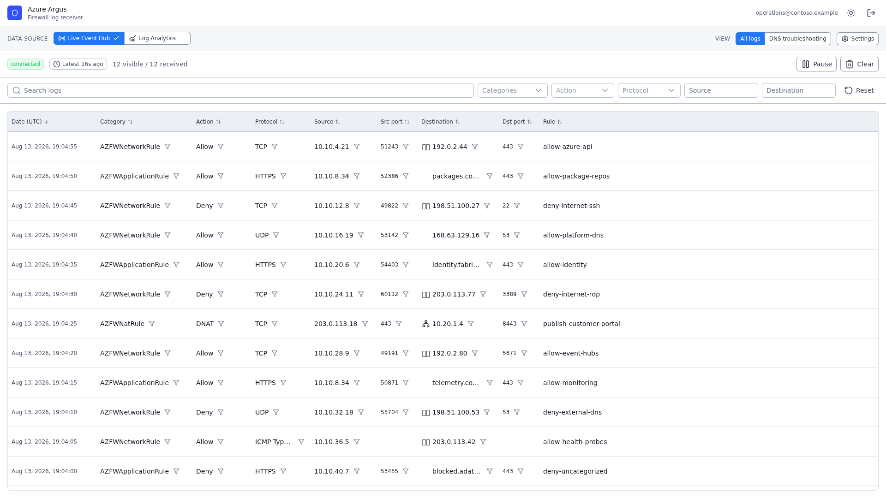
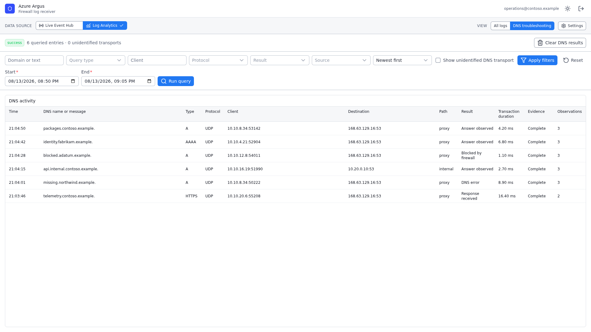

# Azure Argus

Browser workspace for receiving, inspecting, and querying Azure Firewall logs. Use the
[public hosted instance](#use-public-hosted-instance) or [deploy Azure Argus](#deploy-your-own-instance)
into your own Azure environment.

## Contents

- [Features](#features)
- [Live Event Hub streaming](#live-event-hub-streaming)
- [DNS analytics](#dns-analytics)
- [Quick start](#quick-start)
  - [Use public hosted instance](#use-public-hosted-instance)
  - [Deploy your own instance](#deploy-your-own-instance)
- [Set up Azure data sources](#set-up-azure-data-sources)
  - [Event Hub and firewall diagnostics](#event-hub-and-firewall-diagnostics)
  - [Log Analytics and DNS](#log-analytics-and-dns)
- [Deployment modes](#deployment-modes)
  - [Temporary mode](#temporary-mode)
  - [Managed mode](#managed-mode)
- [Configuration reference](#configuration-reference)
  - [Application deployment](#application-deployment)
  - [Custom domains](#custom-domains)
  - [Important settings](#important-settings)
  - [IP geolocation](#ip-geolocation)
- [Development and contributing](#development-and-contributing)
- [License](#license)

## Features

- Stream live Azure Firewall logs from Event Hubs with pause, resume, filtering, and wall-time lag.
- Query historical network, application, NAT, and DNS data through Azure Log Analytics.
- Search, sort, filter, and inspect raw records in a virtualized high-volume table.
- Add or remove filters directly from filterable table values.
- Optionally retain normalized logs in browser storage for local analysis.
- Resolve public destination IPs to country flags.
- Run without application login in [temporary mode](#temporary-mode), or use fixed data sources and
  OIDC login in [managed mode](#managed-mode).

## Live Event Hub streaming



## DNS analytics



## Quick start

### Use public hosted instance

Open [azureargus.vsrn.cc](https://azureargus.vsrn.cc). Public instance uses
[temporary mode](#temporary-mode), so no Azure Argus deployment or application login is required.

Choose data source:

- For live firewall events, [deploy Event Hub and firewall diagnostics](#event-hub-and-firewall-diagnostics),
  copy generated listen-only connection string, then connect it in **Live Event Hub settings**.
- For historical logs and DNS analysis, first [configure Log Analytics ingestion](#log-analytics-and-dns),
  then [connect delegated Log Analytics access](#use-delegated-log-analytics-as-an-operator).

### Deploy your own instance

[](https://portal.azure.com/#create/Microsoft.Template/uri/https%3A%2F%2Fraw.githubusercontent.com%2FVisorian%2Fazureargus%2Fmain%2Finfrastructure%2Fapplication%2Fazuredeploy.json)

Template deploys Azure Argus to Azure Container Apps in [temporary mode](#temporary-mode). After
deployment, [prepare data sources](#set-up-azure-data-sources). For fixed server-side data sources and
application login, use [managed mode](#managed-mode).

Review [application deployment details](#application-deployment) and
[Azure Container Apps pricing](https://azure.microsoft.com/pricing/details/container-apps/) before
deployment.

## Set up Azure data sources

Data-source setup is shared by public, self-hosted temporary, and managed deployments. Temporary mode
uses credentials supplied by operator in browser. Managed mode keeps fixed credentials server-side.

### Event Hub and firewall diagnostics

Choose whether to create only Event Hub resources or also configure diagnostic forwarding from
existing Azure Firewall. Both templates create one-throughput-unit Standard Event Hubs namespace,
Event Hub, and entity-level `azureargus-listen` policy.

**Event Hub only**

[](https://portal.azure.com/#create/Microsoft.Template/uri/https%3A%2F%2Fraw.githubusercontent.com%2FVisorian%2Fazureargus%2Fmain%2Finfrastructure%2Fevent-hub%2Fazuredeploy-event-hub-only.json)

**Event Hub and firewall diagnostics**

[](https://portal.azure.com/#create/Microsoft.Template/uri/https%3A%2F%2Fraw.githubusercontent.com%2FVisorian%2Fazureargus%2Fmain%2Finfrastructure%2Fevent-hub%2Fazuredeploy.json)

#### Before deployment

- For firewall diagnostics, select subscription containing firewall. Event Hubs and firewall resource
  groups must be in same subscription.
- Verify Event Hubs Standard is available in firewall region. Template creates namespace in that
  region because regional diagnostic destinations must match.
- Firewall supports at most five diagnostic settings. Diagnostics deployment uses one.
- Standard namespace incurs charges until deleted. Check current
  [regional pricing](https://azure.microsoft.com/pricing/details/event-hubs/).

#### Required permissions

Deploying identity needs these control-plane permissions, directly or through broader roles:

- On selected Event Hubs resource group: `Microsoft.Resources/deployments/*`; resource management
  access for Event Hubs namespaces, event hubs, and authorization rules;
  `Microsoft.EventHub/namespaces/authorizationRules/listkeys/action`; and
  `Microsoft.EventHub/namespaces/eventhubs/authorizationRules/listkeys/action`.
- For firewall diagnostics, on firewall resource group: `Microsoft.Resources/deployments/*`,
  `Microsoft.Network/azureFirewalls/read`, `Microsoft.Insights/diagnosticSettings/read`, and
  `Microsoft.Insights/diagnosticSettings/write`.

#### Deployment parameters and outputs

In portal, choose Event Hubs resource group as deployment resource group. Both templates accept
**Event Hub name** (default `azureargus`) and **Event Hub retention hours** (default `1`, range
`1`–`168`). Diagnostics template also requires:

- **Firewall resource group name**.
- **Firewall name**.

Both deployments output generated namespace and Event Hub identities. Diagnostics deployment also
outputs exact diagnostic-setting name and resource ID. It uses namespace
`RootManageSharedAccessKey` only for Azure Monitor diagnostic delivery. Both deployments create
separate event-hub-level `azureargus-listen` policy with only `Listen` permission for Azure Argus.

#### Connect Azure Argus

1. Open generated namespace, select Event Hub, then open **Shared access policies** >
   **azureargus-listen**.
2. Copy **Primary Connection String**. It must contain `EntityPath=<event-hub-name>`. Never use
   namespace-level or `RootManageSharedAccessKey` connection string in Azure Argus.
3. In temporary mode, paste connection string into **Live Event Hub settings** and connect. Leave
   consumer group as `$Default` unless another consumer group is intentional. In
   [managed mode](#configure-fixed-data-sources), set connection string server-side instead.

Treat connection string as secret: do not include it in screenshots, logs, issues, or chat. It
remains in memory unless **Remember connection string** stores it unencrypted in browser storage.

#### Retention and delivery

Event Hub retention controls how long Azure retains unread broker events; default is one hour. Event
Hub lookback controls where Azure Argus starts reading within retained stream and remains 1–15
minutes. Local log retention separately stores records already received by browser, optionally up to
100,000 records for 24 hours.

After diagnostic-setting creation, check once per minute for incoming events; they usually start
flowing within 20 minutes. See
[Azure Monitor diagnostic settings](https://learn.microsoft.com/azure/azure-monitor/platform/diagnostic-settings)
and [Event Hubs connection-string guidance](https://learn.microsoft.com/azure/event-hubs/event-hubs-get-connection-string).

#### Cleanup

1. Disconnect Azure Argus, uncheck **Remember connection string**, reload page, and confirm connection
   string remains cleared. Complete this before deleting `azureargus-listen` or Event Hubs resources.
2. If firewall diagnostics were deployed, record `diagnosticSettingName` and
   `diagnosticSettingResourceId` from deployment outputs. On firewall, delete only that exact
   diagnostic setting. Do not remove unrelated firewall settings. Check once per minute and continue
   after setting is absent twice in row. Event Hub-only deployments skip this step.
3. Delete generated namespace identified by `eventHubNamespaceName` to stop Standard namespace
   charges. Delete selected resource group only when dedicated to this deployment and empty of
   unrelated resources. To revoke browser access while retaining forwarding, delete only
   event-hub-level `azureargus-listen` policy.

Cleanup requires delete permission for exact diagnostic setting and listener policy or namespace
being removed.

### Log Analytics and DNS

Log Analytics provides historical queries and DNS analysis. If workspace already receives required
Azure Firewall resource-specific logs, continue with authorization for [temporary mode](#temporary-mode)
or [managed mode](#managed-mode).

#### Configure Azure Firewall ingestion

1. Create or select Log Analytics workspace. Record workspace ID GUID, not ARM resource ID.
2. On Azure Firewall, add separate diagnostic setting, select **Send to Log Analytics workspace**,
   choose workspace, and use **Resource specific** destination tables.
3. Select structured Network Rule (`AZFWNetworkRule`), Application Rule (`AZFWApplicationRule`), and
   NAT Rule (`AZFWNatRule`) categories. For DNS troubleshooting, also enable available DNS Query,
   DNS Flow Trace, Internal FQDN Resolution Failure, and Flow Trace categories as needed. DNS Flow
   Trace supports Log Analytics or Storage, not Event Hub.

Resource-specific tables are recommended for new setups. Azure Argus can query existing
`AzureDiagnostics` network-rule data, but full core-category coverage requires structured tables.
Log delivery can take up to 30 minutes after diagnostic settings change.

## Deployment modes

|                        | [Temporary mode](#temporary-mode)                        | [Managed mode](#managed-mode)                 |
| ---------------------- | -------------------------------------------------------- | --------------------------------------------- |
| Azure Argus login      | None                                                     | Required OIDC login                           |
| Event Hub              | User enters listen-only SAS in browser                   | Deployment supplies fixed server-side SAS     |
| Log Analytics          | Signed-in user's delegated access                        | Fixed service principal and workspace         |
| Credential lifetime    | Browser memory unless Event Hub credential is remembered | Server environment; never returned to browser |
| Available data sources | Event Hub plus optional delegated Log Analytics          | Only fully configured fixed sources           |

Setting any `NUXT_EVENT_HUB_*` or `NUXT_LOG_ANALYTICS_*` value selects managed mode and requires
complete OIDC login configuration. Partial or malformed fixed-source groups make deployment invalid;
Azure Argus does not fall back to temporary mode. `NUXT_PUBLIC_LOG_ANALYTICS_DELEGATED_CLIENT_ID`
alone keeps temporary mode. Managed deployment with only one fixed source does not retain temporary
access to other source.

### Temporary mode

Temporary mode runs without Azure Argus login. Users provide Event Hub credential or use their own
delegated Log Analytics access. No environment variables are required for Event Hub-only use.

Public hosted instance already runs in temporary mode. Self-hosters can use same Event Hub flow and
optionally [enable delegated Log Analytics](#enable-delegated-log-analytics-for-self-hosted-instance).

#### Use delegated Log Analytics as an operator

Before connecting:

- If application consent is not already granted, tenant admin must use Azure Argus **Grant tenant
  consent** action once for target tenant. Consent creates tenant-local enterprise application/service
  principal; it does not grant workspace data access.
- Signed-in users or groups need `Log Analytics Data Reader` at workspace scope.

In Azure Argus, connect Azure account, select directory, grant or refresh consent, select workspace,
then run query. Azure Resource Manager discovery and Log Analytics query authorization use separate
tokens. Tokens and selected IDs stay in browser memory and clear on disconnect or page exit. See
[multitenant enterprise application setup](https://learn.microsoft.com/entra/identity/enterprise-apps/create-service-principal-cross-tenant).

#### Enable delegated Log Analytics for self-hosted instance

1. In home tenant, create Microsoft Entra app registration with **Accounts in any organizational
   directory**.
2. Under **Authentication**, add SPA redirect URI
   `https://YOUR_APP/log-analytics-redirect.html`. For local development, add
   `http://localhost:3000/log-analytics-redirect.html`.
3. Add delegated API permissions `Log Analytics API / Data.Read` and
   `Azure Service Management / user_impersonation`. No client secret is used.
4. Set browser-visible application client ID and restart Azure Argus:

   ```dotenv
   NUXT_PUBLIC_LOG_ANALYTICS_DELEGATED_CLIENT_ID=<application-client-id>
   ```

Do not set `Cross-Origin-Opener-Policy` on redirect bridge page; MSAL popup communication requires
opener context. Users still need [tenant consent and workspace access](#use-delegated-log-analytics-as-an-operator).

### Managed mode

Managed mode fixes data sources at deployment, requires Azure Argus login, and removes user-provided
source credentials. Configure at least one complete fixed-source group plus all login values.

#### Configure application login

Create separate Entra app registration for Azure Argus login. Add **Web** redirect URI matching
`https://YOUR_APP/auth/entra/callback`, create client secret, then set:

```dotenv
NUXT_OIDC_PROVIDERS_ENTRA_CLIENT_ID=<login-application-client-id>
NUXT_OIDC_PROVIDERS_ENTRA_CLIENT_SECRET=<login-client-secret>
NUXT_OIDC_PROVIDERS_ENTRA_REDIRECT_URI=https://YOUR_APP/auth/entra/callback
NUXT_OIDC_PROVIDERS_ENTRA_AUTHORIZATION_URL=https://login.microsoftonline.com/<login-tenant-id>/oauth2/v2.0/authorize
NUXT_OIDC_PROVIDERS_ENTRA_TOKEN_URL=https://login.microsoftonline.com/<login-tenant-id>/oauth2/v2.0/token
NUXT_OIDC_SESSION_SECRET=<random-string-at-least-48-characters>
NUXT_OIDC_AUTH_SESSION_SECRET=<random-string-at-least-32-characters>
NUXT_OIDC_TOKEN_KEY=<base64-encoded-32-byte-key>
```

Optional logout endpoint uses `NUXT_OIDC_PROVIDERS_ENTRA_LOGOUT_URL`. Login application only
authenticates Azure Argus users; it does not authorize Log Analytics or Event Hub access.

#### Configure fixed data sources

For Log Analytics, create independent Entra app registration/service principal and client secret.
Assign service principal `Log Analytics Data Reader` at target workspace, then set:

```dotenv
NUXT_LOG_ANALYTICS_TENANT_ID=<workspace-tenant-id>
NUXT_LOG_ANALYTICS_CLIENT_ID=<service-principal-client-id>
NUXT_LOG_ANALYTICS_CLIENT_SECRET=<service-principal-client-secret>
NUXT_LOG_ANALYTICS_WORKSPACE_ID=<workspace-id-guid>
```

Azure Argus uses OAuth client-credentials flow; no user consent is required. Login and Log Analytics
applications are independent and may belong to different tenants. See
[Log Analytics API app registration](https://learn.microsoft.com/azure/azure-monitor/logs/api/register-app-for-token)
and [`Log Analytics Data Reader` permissions](https://learn.microsoft.com/azure/role-based-access-control/built-in-roles/monitor#log-analytics-data-reader).

For fixed Event Hub, complete [Event Hub and firewall diagnostics](#event-hub-and-firewall-diagnostics),
keep listen-only SAS server-side, and set:

```dotenv
NUXT_EVENT_HUB_CONNECTION_STRING=<listen-only-connection-string>
NUXT_EVENT_HUB_NAME=<required-only-when-EntityPath-is-absent>
```

Current implementation does not support Microsoft Entra service-principal or managed-identity Event
Hub authentication. Connection-string-free managed Event Hub setup is unavailable.

## Configuration reference

### Application deployment

Application template deploys public temporary-mode Azure Argus to Azure Container Apps using stable
version image `ghcr.io/visorian/azureargus:0.3.0`. Published release metadata records image digest as
immutable release identity.

Application uses HTTPS ingress, scales from zero to one replica, and stores no Event Hub credential or
Azure token server-side. Anyone with generated URL can open application. Leave **Delegated Client
ID** empty for Event Hub-only use, or enter multitenant Entra application client ID to
[enable temporary Log Analytics](#enable-delegated-log-analytics-for-self-hosted-instance).

Event Hub and firewall resources use separate
[data-source deployments](#event-hub-and-firewall-diagnostics).

### Custom domains

For first-time custom-domain setup, deploy with **Custom Domain Name** empty, then use
`applicationName` and `applicationUrl` outputs to configure direct CNAME. Retrieve TXT verification
value with:

```bash
AZUREARGUS_DELEGATED_CLIENT_ID=<application-client-id> az deployment group create \
  --resource-group <resource-group> \
  --parameters infrastructure/application/public-gwc.bicepparam customDomainName=''

az containerapp show --resource-group <resource-group> --name <applicationName> \
  --query properties.customDomainVerificationId --output tsv
```

After external CNAME/TXT and any required DigiCert CAA policy are ready, configure managed
certificate in Container Apps portal. Subsequent deployments can set custom domain with automatic
binding. Template creates no Azure DNS or certificate resources.

### Important settings

| Setting                    | Behavior                                                                                      |
| -------------------------- | --------------------------------------------------------------------------------------------- |
| Event Hub consumer group   | Defaults to `$Default`; shared group divides partitions among consumers                       |
| Event Hub lookback         | 1, 3, 5, 10, or 15 minutes; default set by `NUXT_PUBLIC_DEFAULT_LOOKBACK_MINUTES`             |
| Visible live rows          | 5,000 by default; filters access 50,000-record rolling buffer; newest replace oldest          |
| Network record correlation | Exact matching `AZFWNetworkRule` and `AzureFirewallNetworkRule` suppress legacy within window |
| Local log retention        | Optional browser IndexedDB; up to 100,000 parsed records for 24 hours                         |
| Log Analytics query        | Absolute range up to 24 hours; result limit 100–5,000                                         |
| Analysis source switch     | Log Analytics pauses live stream; first query disconnects it; returning cancels query         |

### IP geolocation

`bun run geoip:update` downloads [pinned DB-IP Country Lite](./scripts/dbip-country-lite.pin.json)
release, verifies archive checksum and MMDB structure, then writes
`.data/dbip-country-lite.mmdb` atomically. File is ignored by Git and read only by Nitro server code;
browser receives only two-letter country results.

Published image bundles pinned database at read-only default path. For deployments that do not use
published image:

1. Run `bun run geoip:update` in controlled build or update job.
2. Mount resulting database read-only into every application instance.
3. Set `NUXT_IP_COUNTRY_DATABASE_PATH` to mounted file and restart instances after replacement.
4. Rate-limit anonymous `/api/ip-country` requests at edge, reject bodies larger than 2 KiB, and do
   not capture request bodies in access logs, APM, or traces.

Application remains usable without database, but destination flags stay disabled. Keep last valid
database when update fails. Refresh pin monthly by updating both `release` and `archiveSha256` from
exact DB-IP archive before rebuilding.

## Development and contributing

Local development requires [Bun](https://bun.sh/). Configuration keys and placeholders are in
[`.env.example`](./.env.example).

```bash
bun install
cp .env.example .env
bun run dev
```

Open `http://localhost:3000`. Test and release guidance is in
[CONTRIBUTING.md](./CONTRIBUTING.md).

## License

Published under [AGPL-3.0-only](./LICENSE).

IP geolocation data is provided by [DB-IP](https://db-ip.com) under
[CC BY 4.0](https://creativecommons.org/licenses/by/4.0/).
